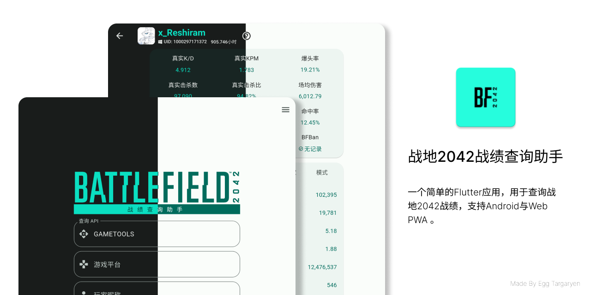

    </img>

    

[English Introduction](./docs/README_EN.md) | [繁體中文介紹](./docs/README_ZH_TW.md)

> 特别感谢[Gametools](https://gametools.network/)，本应用使用了其提供的API。
>
> [BFBan](https://bfban.com/)数据来自其公开接口，本应用不对结果负责！如有疑问请直接联系BFBan。

## 下载地址

- Android 64位版: [点击进入下载地址](https://github.com/dzxrly/BF2042State2.0/releases/latest)

- 网页端 (支持PWA应用): [BF2042State Web Page](https://dzxrly.github.io/BF2042StateWeb/)

- iOS版本: 由于开发者没有苹果设备，暂时不提供iOS版本

## 开发计划

[BF2042State V2 开发计划](https://github.com/users/dzxrly/projects/3)

## FAQ

1. **Q：为什么查询战绩时报错？**

   A：

   - `gametools.network`的服务器负载能力有限，可能会因为负载过高而故障，这时候只能等待服务器恢复正常后再查询。
   - 可能输入的用户名有误，或平台选择错误。
   - 可能用户的战绩未能被`gametools.network`收录，这时候只能等待`gametools.network`收录后再查询。

2. **Q：能查询到隐藏战绩的玩家吗？**

   A：理论上可以。

3. **Q：为什么查询到的战绩是旧的战绩？**

   A：`gametools.network`的服务器可能出现了故障返回了旧的数据，这时候只能等待服务器恢复正常后再查询。

4. **Q：`真实KD`和`真实KPM`是什么意思？**

   A：`真实KD`和`真实KPM`是除去AI击杀后的KD和KPM。

5. **Q：`真实击杀比`是什么意思？**

   A：`真实击杀比`是击杀的真实玩家占总击杀数的比例。

6. **Q：为什么软件内的游戏时长与Steam/EA App等平台的游戏时长不一致？**

   A：`gametools.network`只记录对局内的游戏时长，且门户或官方AI房并不计入游戏时长。

7. **Q：武器和载具等具体数据包含AI击杀吗？**

   A：包含。

8. **Q：为什么没有玩家等级显示？**

   A：`gametools.network`并不提供玩家等级的数据，所以无法显示。

9. **Q：`UID`怎么获取？**

   A：只能先用昵称查询，然后在查询结果中查看`UID`。

10. **Q：我被BFBan了怎么办？**

    A：请自行前往[BFBan官网](https://bfban.com/)查看原因，本应用不对该结果负责！

---

	

