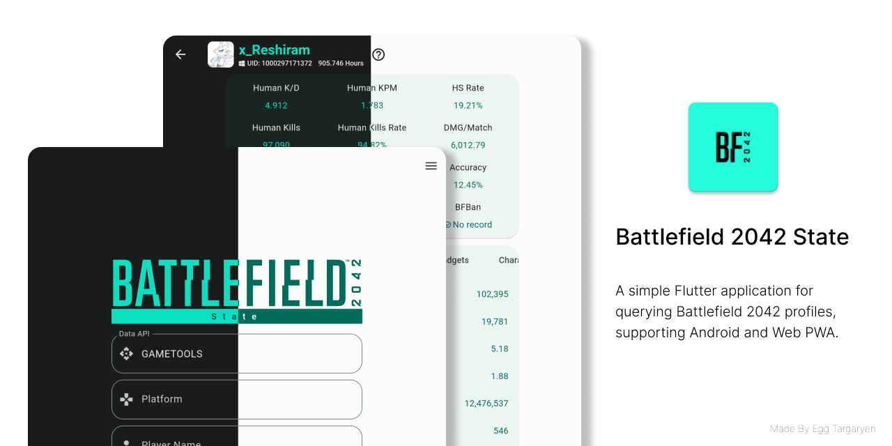

    </img>

    

[简体中文介绍](../README.md) | [繁體中文介紹](./README_ZH_TW.md)

> Special thanks to [Gametools](https://gametools.network/), whose API is used in this application.
>
> The [BFBan](https://bfban.com/) data comes from its public interface and this application is not
> responsible for the results! Please contact BFBan directly if you have any questions

## Download

- Android 64bit: [Click to download](https://github.com/dzxrly/BF2042State2.0/releases/latest)

- Web (Support PWA): [BF2042State Web Page](https://dzxrly.github.io/BF2042StateWeb/)

- iOS: No iOS version is available at this time because the developer does not have an Apple device.

## Development Plan

[BF2042State V2 Development Plan](https://github.com/users/dzxrly/projects/3)

## FAQ

1. **Q: Why does it report an error when querying the record?**

   A:

   - The server load capacity of `gametools.network` is limited, and it may fail due to high load.
     At this time, you can only wait for the server to return to normal before querying.
   - The username entered may be incorrect, or the platform selection is wrong.
   - The user's record may not be included in `gametools.network`, and you can only wait
     for `gametools.network` to include it before querying.

2. **Q: Can I query players with hidden records?**

   A: In theory, yes.

3. **Q: Why is the record queried old?**

   A: The server of `gametools.network` may have failed and returned old data. At this time, you can
   only wait for the server to return to normal before querying.

4. **Q: What does `Human KD` and `Human KPM` mean?**

   A: `Human KD` and `Human KPM` are KD and KPM without AI kills.

5. **Q: What does `Human Kill Ratio` mean?**

   A: `Human Kill Ratio` is the ratio of kills to real players to total kills.

6. **Q: Why is the game time in the software inconsistent with the game time on platforms such as
   Steam/EA App?**

   A: `gametools.network` only records the game time in the game, and the Portal or official AI room
   does not count towards the game time.

7. **Q: Does the specific data of weapons and vehicles include AI kills?**

   A: Yes.

8. **Q: Why is there no player level display?**

   A: `gametools.network` does not provide player level data, so it cannot be displayed.

9. **Q: How to get `UID`?**

   A: You can only query by player name first, and then check the `UID` in the query result.

10. **Q: What should I do if I am banned by BFBan?**

    A: Please go to the [BFBan official website](https://bfban.com/) to check the reason. This
    application is not responsible for the result!

---

	

