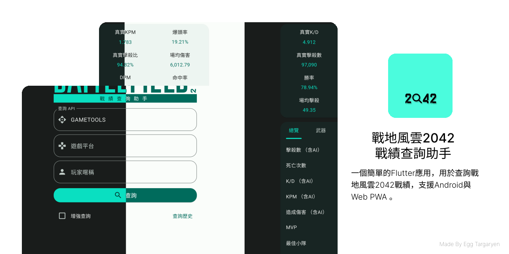

    </img>

    

[English Introduction](./README_EN.md) | [简体中文介绍](../README.md)

> [!NOTE]
> 特別感謝[Gametools](https://gametools.network/)，本應用程式使用了其提供的API。
>
> [BFBan](https://bfban.com/)資料來自其公開介面，本應用程式不對結果負責！ 如有疑問請直接聯絡BFBan。

## 下載地址

- Android 64位版: [點擊進入下載地址](https://github.com/dzxrly/BF2042State2.0/releases/latest)

- Google Play (Alpha Test): [更多資訊](https://github.com/dzxrly/BF2042State2.0/issues/7)

- 網頁端 (支持PWA應用): [BF2042State Web Page](https://dzxrly.github.io/BF2042StateWeb/)

- iOS版本: 由於開發者沒有蘋果設備，暫時不提供iOS版本

## 開發計劃

[BF2042State V2 開發計劃](https://github.com/users/dzxrly/projects/3)

## FAQ

1. **Q：為什麼查詢戰績時報錯？**

   A：

   - `gametools.network`的伺服器負載能力有限，可能會因為負載過高而故障，這時候只能等待伺服器恢復正常後再查詢。
   - 可能輸入的使用者名稱有誤，或平台選擇錯誤。
   - 可能用戶的戰績未能被`gametools.network`收錄，這時候只能等待`gametools.network`收錄後再查詢。

2. **Q：能查詢到隱藏戰績的玩家嗎？**

   A：理論上可以。

3. **Q：為什麼查詢到的戰績是舊的戰績？**

   A：`gametools.network`的伺服器可能出現了故障返回了舊的資料，這時候只能等待伺服器恢復正常後再查詢。

4. **Q：`真實KD`和`真實KPM`是什麼意思？**

   A：`真實KD`和`真實KPM`是除去AI擊殺後的KD和KPM。

5. **Q：`真實擊殺比`是什麼意思？**

   A：`真實擊殺比`是擊殺的真實玩家占總擊殺數的比例。

6. **Q：為什麼軟體內的遊戲時長與Steam/EA App等平台的遊戲時長不一致？**

   A：`gametools.network`只記錄對局內的遊戲時長，且Portal或官方AI房並不計入遊戲時長。

7. **Q：武器和載具等具體資料包含AI擊殺嗎？**

   A：包含。

8. **Q：`UID`怎麼獲取？**

   A：只能先用暱稱查詢，然後在查詢結果中查看`UID`。

9. **Q：我被BFBan了怎麼辦？**

    A：請直接聯絡[BFBan](https://bfban.com/)。

## 隱私政策

[隱私政策](../privacy.md)

---

	

